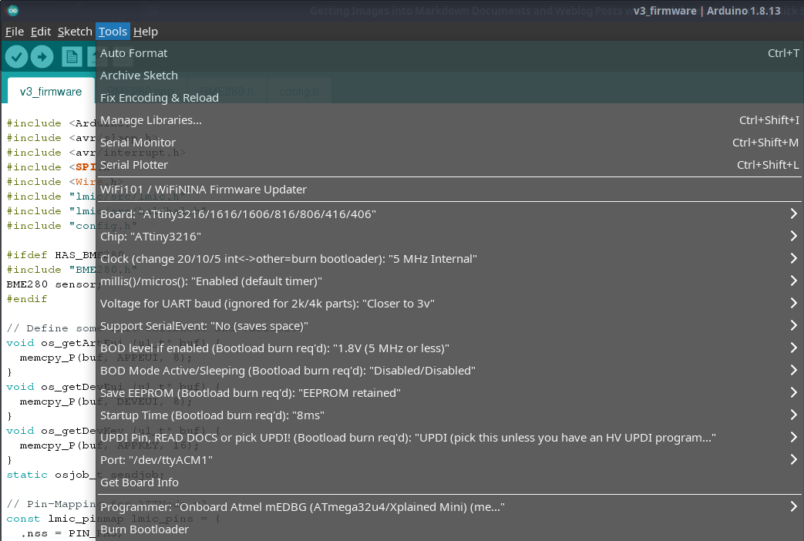

# ATTNode v3 Firmware (WiP)

## Disclaimer

THIS IS STILL WORK IN PROGRESS!

## Configuration and Programming

This is the Work in Progress Repository for ATTNode v3 compatible firmware. At the moment it supports LoRa communication using OTAA and a BME280 sensor, as well as deep sleep between measurements. 

As there is no PlatformIO Support for the ATTiny3216 yet, it is (for now) developed using Arduino IDE and the [MegaTinyCore](https://github.com/SpenceKonde/megaTinyCore). You also need to set the correct Settings for programming the ATTiny3216 in ArduionIDE. Here is a screenshot of the settings I use:

You also need to install the MCCI Arduino LMIC Library form the IDEs Library Manager or from https://github.com/mcci-catena/arduino-lmic

Before Compiling and Flashing make sure to copy config.h.example to config.h and set your LoRa OTAA Keys there. You can also set the Sending Interval and used Sensors there.

Programming is done using a [MicroUPDI Programmer](https://github.com/MCUdude/microUPDI) - for other pogramming variants see the MegaTinyCore documentation.

## Acknowledgements

Parts of this code where kindly provided by [@shempe](https://twitter.com/shempe)
